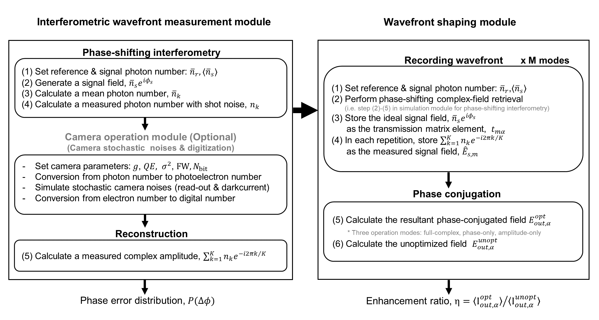

# Monte Carlo simulation of interferometric measurement and wavefront shaping under influence of shot noise and camera noise 
# Abstract
Interferometry often serves as an essential building block of wavefront shaping systems to obtain optimal wavefront solutions. In this tutorial, we provide a Monte Carlo simulation tool to calculate the accuracy of interferometric measurement and its impact on wavefront shaping in the context of focusing through disordered media. In particular, we have focused on evaluating wavefront shaping fidelity under the influence of shot noise with practical considerations on the operation of digtial image sensors, including read-out and dark current noises, and digitization with finite bit-detph. Based on some exemplary simulation results, we provide practical guidance for setting up an interferometric measurement system for wavefront shaping applications.



# Overview   
    ├── library                              # Function library 
    │   ├── Interferometry                   # Interferometric wavefront measurement module
    │     ├── Initialize                     # Initialize structures (e.g. Graphic, Photon number, Camera operation, SLM operation mode)
    │     ├── Phase-shifitng interferometry  # Phase-shifting interferometry
    │   ├── Wavefront_shaping                # Wavefront shaping module
    │   └── Make_figure                      # Functions for draw each figure in paper
    └── README.md

paper의 각 figure를 reproduce 할 수 있도록 matlab file을 업로드하였다. 각 파일은 동일한 구조로 이루어져 있다. 
1) Initialization
2) Main loop
3) save 

Initialization에서 사용자가 원하는 파라미터를 입력하여 필요한 structure를 initialize한다. 
Main loop는 flow chart의 순서대로 Interferometric wavefront meausrement module과 wavefront shaping module로 구성되어있다. 
Interferometry 폴더에는 Interferometric wavefront meausrement module에 필요한 함수들이 담겨져 있다. 
- Signal_field_generate
- Interference_generate
- Add_shotnoise
- Reconstruct_signal_field
- Phase_error_distribution_graph
  
Wavefront shaping 폴더에는 Wavefront shaping module에 대응되는 함수들이 담겨져 있다. Interferomteric wavefront meausurement module과 중복되는 함수는 제외하였다. 
- Calculate enhancement
- Calculate_unoptimized_field
- Enhancement_graph 


# Getting started 
## 1) Clone the repository
```
git clone https://github.com/wavefrontshaping-MonteCarlo/tutorial_interferometry_fidelity_noises.git
cd tutorial_interferometry_fidelity_noises/

```
## 2) Run the scripts
Each matlab files reproduce the figure of the paper.

